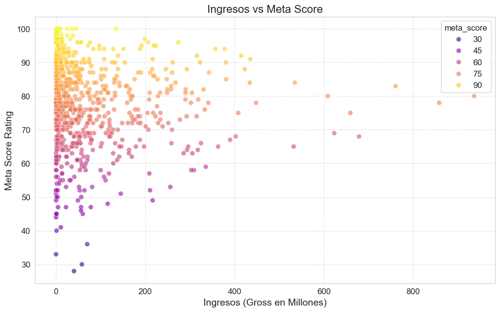

# Análisis Exploratorio de Datos (EDA) del Top 1000 Películas de IMDb

Este proyecto realiza un Análisis Exploratorio de Datos (EDA) sobre un dataset de las 1000 películas mejor valoradas en IMDb. El objetivo principal es descubrir patrones, tendencias y relaciones clave dentro de los datos para obtener una comprensión profunda de las características que definen a estas películas aclamadas.

El análisis se ha estructurado en varias preguntas clave, abordando aspectos como la valoración de películas, la distribución de géneros, las tendencias a lo largo del tiempo, la relación entre ingresos y ratings/popularidad, y el desempeño de directores y actores.

## Hallazgos y Conclusiones del EDA

A continuación, se presentan los hallazgos clave derivados del análisis de cada pregunta.

### **Pregunta 1: Top 5 Películas Mejor Valoradas**

Este análisis identificó las 5 películas con las puntuaciones más altas combinadas de IMDB Rating y Metascore, revelando insights sobre su aclamación por parte de la audiencia y la crítica.

**Conclusiones:**
* **Películas en el Top 5:** Las 5 películas mejor valoradas, según la combinación de IMDB Rating y Metascore, son consistentemente clásicos cinematográficos: "The Shawshank Redemption", "The Godfather", "12 Angry Men", "The Godfather: Part II" y "The Dark Knight". Esto indica que la lista está dominada por obras que han mantenido su aclamación a lo largo del tiempo.
* **IMDB Rating vs. Metascore:** Se observan diferencias interesantes en cómo audiencias y críticos valoran estas películas.
    * "The Shawshank Redemption" es valorada extremadamente alta por la audiencia (IMDB 93.0 escalado) pero ligeramente menos por los críticos (Metascore 80.0), aunque ambos son excelentes.
    * "The Godfather" y "12 Angry Men" son consideradas casi perfectas por los críticos (Metascore 100.0 y 96.0 respectivamente) superando sus IMDB Ratings escalados (92.0 y 90.0).
    * "The Godfather: Part II" muestra una concordancia perfecta entre ambos ratings (90.0).
    * "The Dark Knight" es valorada más alto por la audiencia (IMDB 90.0) que por los críticos (Metascore 84.0).
* **Consistencia en la Excelencia:** A pesar de las ligeras discrepancias, todas las películas en este top 5 exhiben puntuaciones excepcionalmente altas en ambas escalas, lo que valida su estatus como obras altamente aclamadas por ambos públicos.

**Gráfico:**

---

### **Pregunta 2: Distribución de Calificaciones entre IMDB y Metascore**

Esta sección examinó cómo se distribuyen las calificaciones de IMDB y Metascore a lo largo de todo el dataset de 1000 películas.

**Conclusiones:**
* **Distribución de IMDB Rating (Escalado):** La distribución de IMDB Rating es fuertemente sesgada hacia valores altos (principalmente entre 75 y 90), con un pico prominente, lo que sugiere un alto consenso en la audiencia para calificar a estas películas en un rango elevado.
* **Distribución de Metascore:** La distribución de Metascore también muestra un sesgo hacia valores altos, pero es más "normal" y dispersa, con un pico alrededor de los 75-80 puntos. Tiene una mayor presencia de películas en rangos de calificación "buenos" (60s y 70s) que IMDB.
* **Comparación Directa:** El IMDB Rating promedio tiende a ser consistentemente más alto y más estrechamente agrupado que el Metascore. Los críticos (Metascore) muestran una mayor variabilidad y utilizan un rango más amplio de la escala, incluyendo puntuaciones más bajas (30-60), donde IMDB tiene escasas entradas.
* **Discrepancia Audiencia vs. Crítica:** En general, la audiencia (IMDB) es más generosa y uniforme en sus puntuaciones para este dataset de alto ranking, mientras que los críticos (Metascore) son más "duros" o más variados en sus opiniones.

**Gráficos:**

---

### **Pregunta 3: Géneros de Películas Más Comunes y su Distribución**

Este análisis identificó los géneros más prevalentes en el dataset y su frecuencia, considerando que una película puede tener múltiples géneros.

**Conclusiones:**
* **Dominio del Drama:** El género "Drama" es, con diferencia, el más común en el dataset, con más de 700 ocurrencias, lo que sugiere que gran parte de las películas altamente valoradas contienen un fuerte componente dramático.
* **Popularidad de Clásicos:** "Comedy", "Crime", "Adventure" y "Action" son los siguientes géneros más frecuentes, cada uno superando las 100 ocurrencias. Esto indica una concentración en géneros ampliamente reconocidos y asociados a narrativas complejas.
* **Diversidad Existente:** Aunque dominan algunos géneros, hay una buena variedad de otros géneros (Thriller, Romance, Biography, etc.) presentes, aunque con menor frecuencia, lo que refleja la diversidad del contenido en el Top 1000.
* **Implicación en la Calidad:** La alta prevalencia del "Drama" podría indicar que las películas con narrativas profundas y personajes complejos tienden a ser mejor valoradas por audiencias y críticos.

**Gráfico:**

---

### **Pregunta 4: Evolución del Número de Películas y Rating Promedio a lo Largo de los Años**

Este segmento exploró las tendencias en el número de películas lanzadas por año y cómo han variado los ratings promedio de IMDB y Metascore a lo largo del tiempo.

**Conclusiones:**
* **Tendencia de Producción:** El número de películas incluidas en el dataset del Top 1000 ha mostrado una clara tendencia creciente a lo largo de los años. Los **años 90 y 2000** vieron un crecimiento significativo, con picos de más de 20-30 películas por año, sugiriendo que décadas más recientes han contribuido con más títulos a esta lista de "top".
* **Estabilidad del IMDB Rating Promedio:** El IMDB Rating promedio (escalado) se ha mantenido consistentemente en un rango muy alto (entre 80 y 90) a lo largo de casi todo el período, lo que indica una alta calidad percibida por la audiencia en las películas que entran en este top.
* **Volatilidad del Metascore Promedio:** El Metascore promedio exhibe una mayor volatilidad y fluctuaciones más pronunciadas en comparación con el IMDB Rating, con picos y caídas más marcados a lo largo de los años.
* **Discrepancia Persistente:** Para la mayoría de los años, el IMDB Rating promedio es consistentemente más alto que el Metascore promedio, reforzando la observación de que la audiencia tiende a ser más generosa en sus calificaciones que los críticos.
* **Tendencias Recientes:** Ambos ratings muestran una ligera tendencia a la estabilidad o incluso un leve descenso en el rating promedio hacia los años más recientes en comparación con décadas anteriores, lo que podría sugerir que las películas clásicas mantienen un alto valor promedio en la percepción general del dataset.

**Gráficos:**

---

### **Pregunta 5: Relación entre Ingresos en Taquilla y Ratings o Número de Votos**

Esta sección exploró cómo los ingresos brutos de las películas se relacionan con sus calificaciones (IMDB Rating y Metascore) y su popularidad (Número de Votos).

**Conclusiones:**
* **Ingresos vs. IMDB Rating (Escalado):** No se observa una correlación lineal fuerte y clara. La mayoría de las películas se concentran en el extremo inferior de los ingresos (menos de 200 millones USD) pero con una amplia gama de IMDB Ratings altos. Esto sugiere que un IMDB Rating alto es una condición necesaria pero no suficiente para un éxito de taquilla masivo; no todas las películas con buenas calificaciones son "blockbusters".
* **Ingresos vs. Metascore:** La relación es igualmente débil. Hay una mayor dispersión en los Metascores para películas con ingresos bajos. Sin embargo, las películas con muy altos ingresos (más de 400 millones USD) tienden a tener Metascores predominantemente altos (por encima de 60-70), indicando que es raro que un éxito de taquilla masivo sea mal recibido por la crítica.
* **Ingresos vs. Número de Votos:** Se aprecia una correlación positiva más clara entre el número de votos y los ingresos en taquilla. Las películas con un mayor número de votos (indicando mayor popularidad y alcance en IMDb) tienden a generar mayores ingresos. Las películas con un alto número de votos (más de 1.5 millones) corresponden casi exclusivamente a altos ingresos (generalmente por encima de los 200 millones).
* **Popularidad sobre Calidad para Ingresos:** Mientras que la popularidad (número de votos) tiene una relación más directa con los ingresos, la calidad percibida (IMDB Rating y Metascore) muestra una correlación más compleja. Un alto rating no garantiza ingresos masivos, pero una gran cantidad de votos es un indicador más fiable de éxito comercial en este dataset.

**Gráficos:**

---

### **Pregunta 6: Directores y Actores Más Prolíficos y Exitosos en Rating o Ingresos**

Este análisis identificó a las figuras más destacadas en términos de cantidad de películas, calidad promedio de sus obras e impacto financiero.

**Conclusiones:**

#### **A. Directores:**
* **Prolíficidad:** **Steven Spielberg** es el director más prolífico en este Top 1000 de IMDb con 13 películas, seguido por Martin Scorsese (10) y Alfred Hitchcock (9).
* **Rating Promedio:** No siempre hay una correlación directa entre ser el más prolífico y tener el rating promedio más alto. **Alfred Hitchcock** destaca con un Meta Score promedio excepcional (casi 93), y **Hayao Miyazaki** muestra alta consistencia en la calidad de sus películas en ambos sistemas de rating.
* **Ingresos Totales:** **Steven Spielberg** también lidera en ingresos totales (aproximadamente $2,400 millones de USD), seguido por **Christopher Nolan** (cercano a los $2,000 millones de USD). Esto resalta su éxito comercial además de su aclamación crítica. Directores clásicos con altos ratings (como Hitchcock y Miyazaki) muestran ingresos brutos menores, posiblemente debido a factores de época.

#### **B. Actores:**
* **Prolíficidad:** **Liam Neeson** es el actor más prolífico como `star1` con 13 películas, seguido por Robert De Niro (10) y Anthony Perkins (9).
* **Rating Promedio:** **Anthony Perkins** tiene un Meta Score promedio excepcionalmente alto (más de 90), y **Daveigh Chase** también muestra ratings promedio muy elevados. Similar a los directores, la prolíficidad no garantiza el rating promedio más alto.
* **Ingresos Totales:** **Liam Neeson** lidera significativamente en ingresos totales (más de $2,000 millones de USD), seguido por **Christian Bale** (más de $1,800 millones de USD). Los actores con más películas y/o que han protagonizado en épocas de mayores recaudaciones tienden a acumular mayores ingresos.

#### **C. Conclusiones Generales (Directores y Actores):**
* Existe una **distinción entre prolíficidad/ingresos y rating promedio**. Las figuras más prolíficas y con mayores ingresos totales (ej., Spielberg, Neeson) no siempre tienen los ratings promedio más altos, aunque sus películas suelen estar bien valoradas.
* **Directores y actores contemporáneos** o con largas carreras tienden a dominar las listas de ingresos totales, reflejando el crecimiento del mercado cinematográfico.
* Figuras como **Steven Spielberg** y **Christopher Nolan** demuestran un éxito integral, combinando prolíficidad, alta calidad y rentabilidad.

**Gráficos de Directores:**

**Gráficos de Actores:**

---

## Conclusiones Generales del EDA

Este análisis exploratorio del Top 1000 películas de IMDb ha revelado varios puntos clave sobre el cine aclamado:

* **Calidad Consistente con Matices:** Las películas en este dataset son, en general, altamente valoradas tanto por la audiencia (IMDB) como por los críticos (Metascore). Sin embargo, la audiencia tiende a ser más generosa y unánime en sus valoraciones, mientras que los críticos muestran una mayor dispersión y un rango de puntuación más amplio.
* **Dominio del Drama:** El género "Drama" es el más predominante entre las películas de alto rating, sugiriendo una preferencia por narrativas complejas y profundas en el cine aclamado.
* **Evolución Temporal:** Las décadas más recientes (especialmente los 90 y 2000) han contribuido con un mayor número de películas a esta lista selecta, aunque las películas clásicas mantienen ratings promedio muy altos.
* **Popularidad vs. Calidad en Taquilla:** La popularidad de una película (medida por el número de votos) tiene una relación más directa y positiva con los ingresos en taquilla que sus ratings de calidad. Un rating alto no garantiza un éxito masivo, pero una gran base de audiencia sí parece correlacionarse con mayores ingresos.
* **Éxito Multifacético de Grandes Figuras:** Directores y actores como Steven Spielberg, Christopher Nolan y Liam Neeson destacan por su capacidad de combinar una alta prolíficidad con la creación de películas bien valoradas y, crucialmente, con un enorme éxito en taquilla, demostrando ser figuras integrales en la industria cinematográfica.
